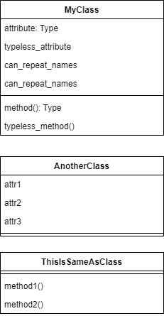

# Dialang

Turn text files into draw.io class diagrams

## Future features
 * [ ] Sequence diagram
 * [ ] Communication diagram
 * [ ] Style modification

# Usage
1. create a `input.txt` file
2. write the diagram
3. run the program in that directory
4. output is in output.drawio

## Syntax

```
class MyClass {
    attribute: Type
    typeless_attribute
    can_repeat_names
    can_repeat_names

    fn method(param: Type, typeless_param): Type
    fn typeless_method()
}

class AnotherClass {
    attr1
    attr2
    attr3
}

struct ThisIsSameAsClass {
    fn method1()
    fn method2()
}
```

This will produce the following diagram:



In addition, it is possible to convert anything to "raw" to bypass syntax rules by surrounding it with \`, such as having spaces in the name ``struct a {`+ attr`: `Type 1`}``, or including special characters ``struct a {`attr()1`: Type}``, ``struct a {`.at:tr1,`: Type}``
